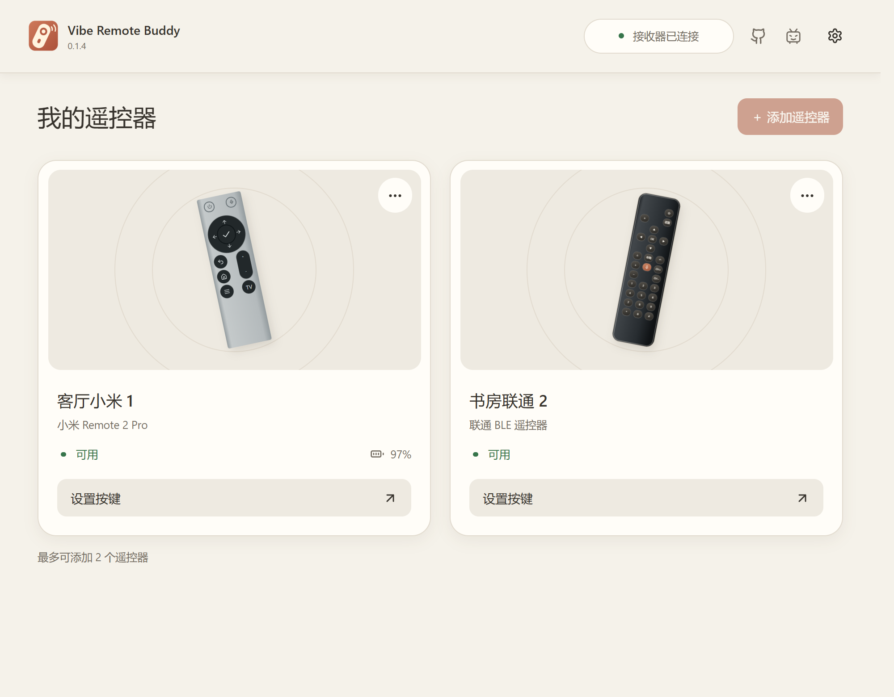

# Vibe Remote Buddy

让蓝牙遥控器也能控制电脑：按键管播放和音量，语音键可以用来听写或在会议中说话。遥控器连接到 USB 接收器；软件用来配对、设置按键和管理设备。

*首页界面示例：一个接收器可保存两只遥控器。图中的设备名称和状态为示例数据。*

## 它能做什么

- **让盒子遥控器用在电脑上。** 已适配小米 Remote 2 Pro、早期小米蓝牙语音遥控器，以及部分联通、移动 IPTV 遥控器。一个接收器可以保存两只遥控器。
- **按键和语音由接收器处理。** 电脑把接收器识别为 USB 键盘、媒体控制设备和麦克风。方向键、音量键、语音键可以直接用，支持的按键还可以改成快捷键。
- **设置好后，不开软件也能用。** 接收器会记住配对和按键设置。打开程序、切换窗口、聚焦输入框等电脑操作则需要软件在后台运行。
- **听写和开会可以各用一套按键。** 语音键可选豆包输入法、微信输入法或视频会议预设；还可以用另一颗键切换平时和会议的语音设置。

## 快速开始

1. 从 [Releases](https://github.com/kxn/vibe-remote-buddy-app/releases) 获取发行包。Windows 安装版运行文件名以 `-setup.exe` 结尾的安装程序，便携版先解压整个 ZIP，再打开 `Vibe Remote Buddy.exe`；macOS（Apple 芯片）打开 `-macos-arm64.dmg`，把应用拖进“应用程序”，并按[常见问题](docs/user-guide.md#常见问题)允许输入监控和辅助功能。
2. 用 USB 数据线连接接收器。软件显示“接收器已连接”后，点“+ 添加遥控器”。空白开发板需要先[初始化接收器](docs/user-guide.md#初始化接收器新板子才需要)。
3. 让遥控器靠近接收器并进入配对状态，在列表里选中它，按提示完成添加。

第一次使用、按键设置和常见问题都有截图，见[完整使用说明](docs/user-guide.md)。

## 使用范围

Windows 版和 macOS（Apple 芯片，已签名公证）版软件均已完成构建和实机验证。接收器采用标准 USB 键盘、媒体键和麦克风接口；macOS 上的豆包、微信语音预设需要软件在后台运行。软件需要运行 Buddy v1 / RBP/3 固件的 Vibe Remote Buddy 接收器，普通蓝牙适配器不能替代它。具体支持的遥控器以添加时的型号检查为准。

## 更多资料

- [图文使用说明](docs/user-guide.md)：连接、配对、按键、语音、更新和 FAQ。
- [开发与构建](docs/development.md)：环境、测试、工程结构和发布流程。
- [型号资源与适配](docs/remote-models.md)：现有机型资源和扩展方式。
- [许可证](LICENSE)与[第三方声明](THIRD_PARTY_NOTICES.md)。

## 开源说明

App 代码目前按 MIT 许可证开源。固件目前包含大量逆向分析相关内容，源码暂不公开；我们正在做净室处理，完成后会开源固件源码。这个仓库的 `receiver-firmware/` 现阶段只提供发布二进制、校验清单和必要声明。
