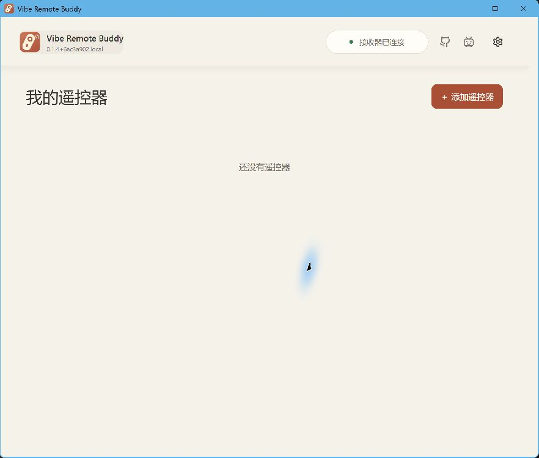
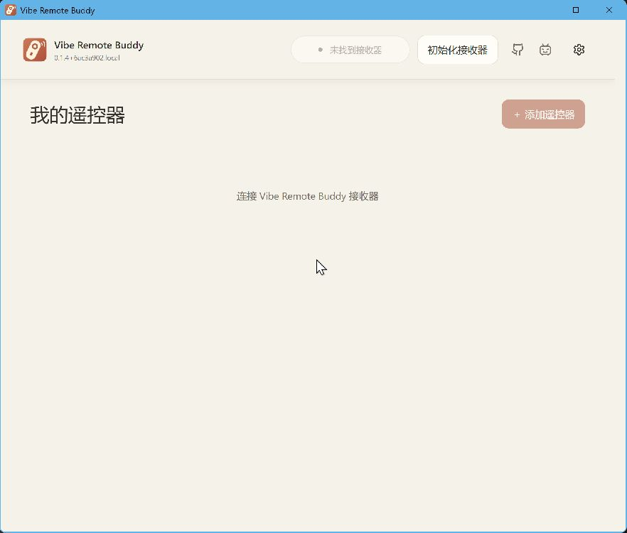
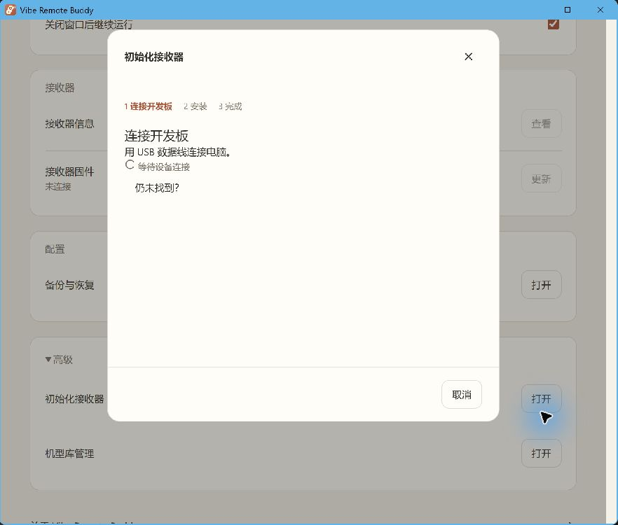
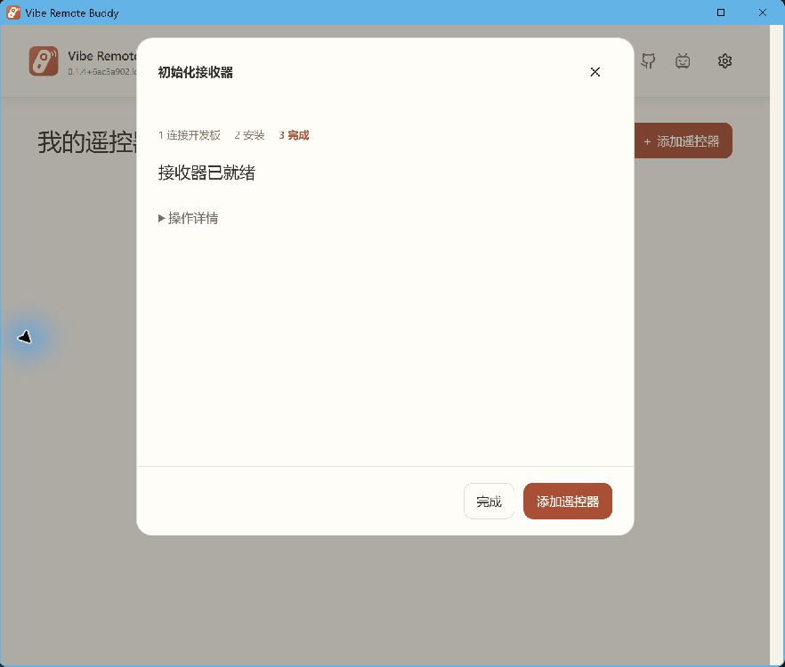
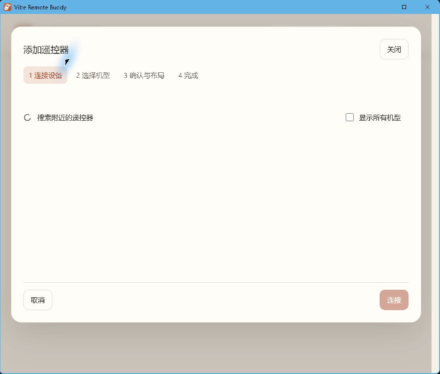
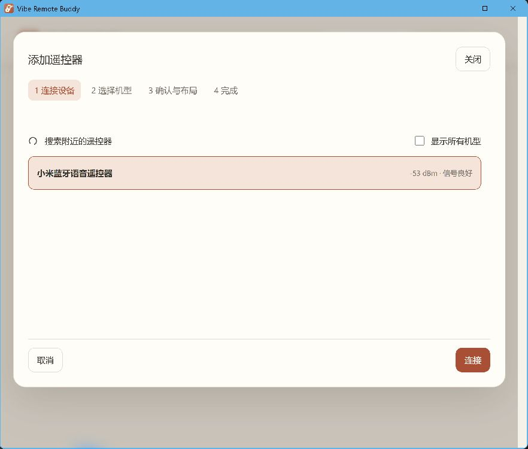
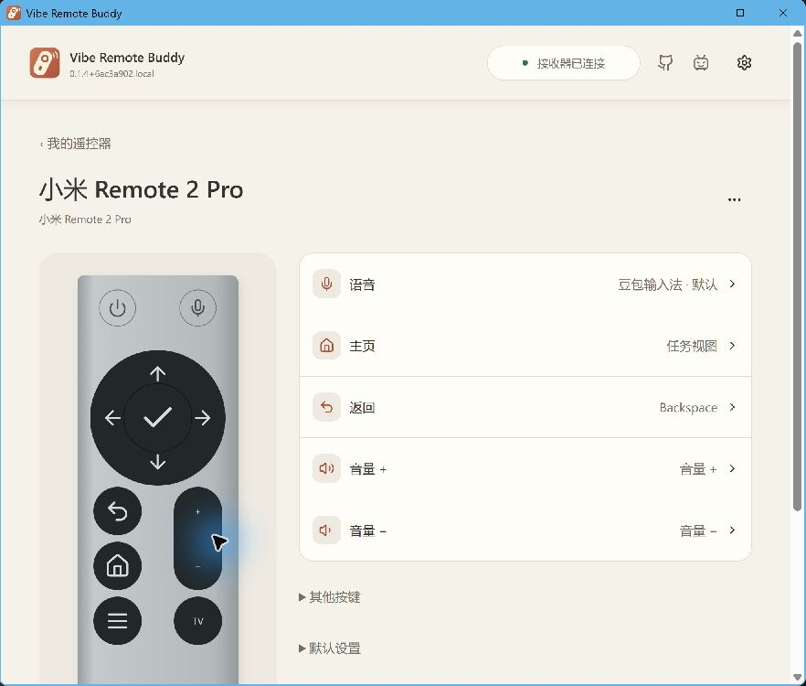
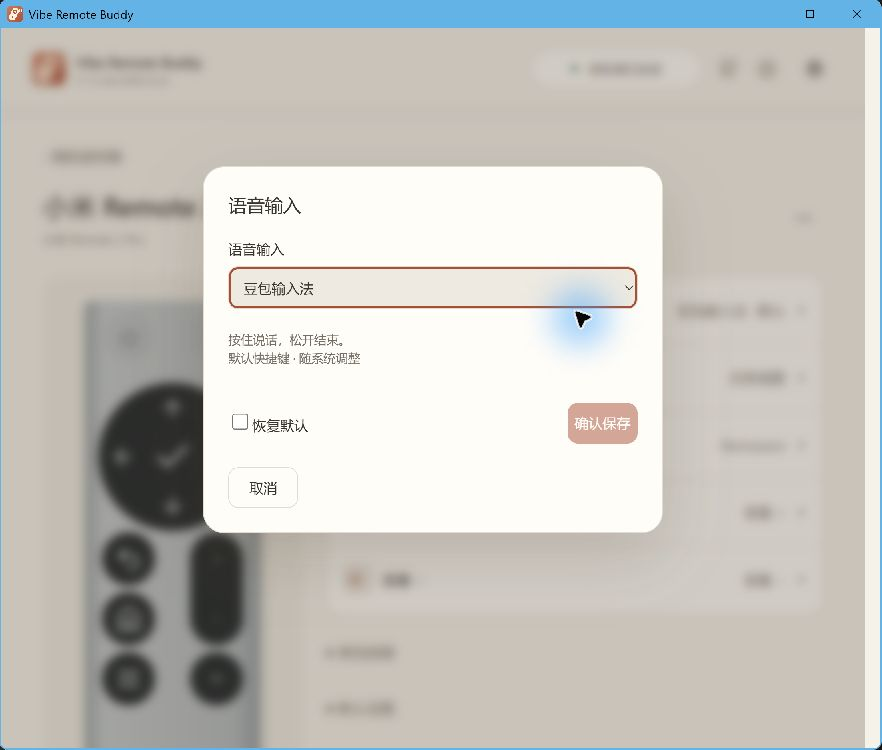
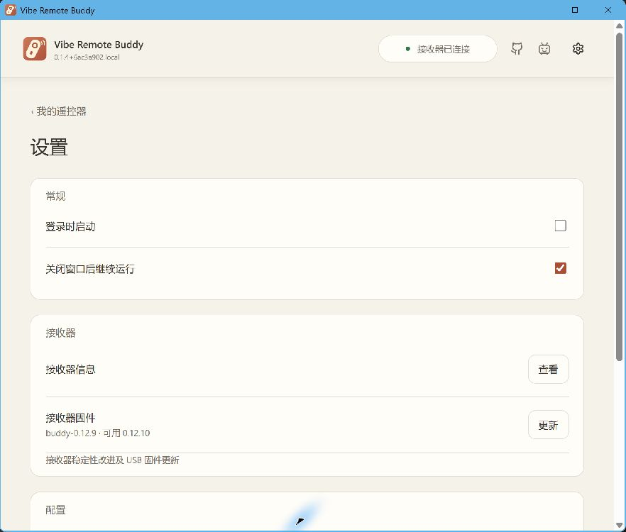

# Vibe Remote Buddy 使用说明

把蓝牙语音遥控器接到电脑上，用实体按键控制播放、音量和常用操作，也能按住语音键说话。本说明以 Windows 应用为例；不同遥控器的名称和按键图可能有所不同。

## 有什么特别之处

- **让更多遥控器派上用场。** 已适配小米 Remote 2 Pro、早期小米蓝牙语音遥控器，以及联通、移动等部分 IPTV 盒子遥控器。按键布局、语音协议不同的机型分别处理；具体能否添加，以应用识别结果为准。
- **接收器直接处理蓝牙。** 电脑会把它当作 USB 键盘、媒体控制设备和麦克风。已识别的实体键可以映射为电脑按键、媒体键或快捷键，语音也从接收器的麦克风进入电脑。
- **日常使用可以关掉 App。** 配对和设置保存在接收器上。方向键、媒体键、语音和会议模式切换由板子自行运行；打开应用、切换窗口、聚焦输入框等电脑操作需要 App 在后台运行。
- **照顾语音输入与会议。** 语音键有豆包输入法、微信输入法和视频会议预设。可把另一颗按键设为“切换会议 / 普通模式”，在输入法与按空格说话之间切换。

接收器采用标准 USB 输入和音频接口，面向 Windows 与 macOS 使用。当前安装包和本说明中的配置流程已在 Windows 验证；macOS 的 App、部分语音快捷键和完整按键兼容性仍待实机验证，见[常见问题](#常见问题)。

## 目录

- [快速开始](#快速开始)
- [第一次连接](#第一次连接)
- [初始化接收器：新板子才需要](#初始化接收器新板子才需要)
- [添加遥控器](#添加遥控器)
- [按键、语音和会议](#按键语音和会议)
- [更新与备份](#更新与备份)
- [常见问题](#常见问题)

## 快速开始

1. 安装应用；使用便携版时，先解压整个压缩包，再打开 `Vibe Remote Buddy.exe`。
2. 用能传数据的 USB 线把接收器接到电脑，**不要按 BOOT**。首页右上角出现“接收器已连接”后继续。全新的开发板请先按[初始化接收器](#初始化接收器新板子才需要)操作。
3. 点“+ 添加遥控器”。把遥控器放在接收器旁边，按遥控器说明进入配对状态。在列表中点选它，再点“连接”。配对状态通常持续不久，先打开搜索页再按配对键会更顺手。
4. 跟着屏幕上的步骤完成添加。回到首页后，按一下方向键试试；需要语音时，在电脑的语音软件里选择接收器的麦克风。

> 平时使用方向键、媒体键和语音键，接收器会自行处理。若把按键设为“切换应用”“聚焦输入框”等电脑操作，请让应用在后台运行。

## 第一次连接

准备好接收器、遥控器及有电的电池、USB 数据线。当前发行版面向 Windows x64。便携包中的 `resources` 文件夹要和 EXE 放在一起。

接入 USB 后，先看应用右上角的状态。显示“接收器已连接”就可以[添加遥控器](#添加遥控器)。Windows 有没有播放插入提示音并不能单独说明连接是否成功。

如果首页显示“未找到接收器”，而手里是尚未装好 Buddy 固件的开发板，请看下一节。已有接收器此前正常使用、只是这次没有连接时，请先看[常见问题](#常见问题)，不要重新初始化。

## 初始化接收器：新板子才需要

**初始化会清除开发板原来的程序、配对记录和设置。** 只在首次安装，或确定要把板子清空重装时使用。应用会检查开发板并选择对应的安装包；看不懂板型或闪存提示时，先停在确认页核对板子规格。

1. 接好开发板。首页出现“初始化接收器”时点击它；也可以从“设置 → 高级 → 初始化接收器”进入。
2. 在“连接开发板”页等待识别。若页面提示进入下载模式，拔下 USB，**按住板子的 BOOT 键再插入 USB，然后松开 BOOT**。识别到一块板子后，点“连接这块开发板”；有多块板子时选择要安装的那一块。
3. 阅读清除提示并确认，等待写入和校验完成。安装过程中不要拔线。
4. 页面显示“接收器已就绪”后，松开 BOOT，拔下 USB 再正常插入一次。如果板子有两个 USB 接口，请使用标着 **USB、OTG 或 Native** 的原生 USB 接口。回到首页，确认右上角显示“接收器已连接”。

## 添加遥控器

接收器最多保存两只遥控器。要换新遥控器，先在首页移除不用的那只。

1. 点首页“+ 添加遥控器”，让遥控器靠近接收器，再按该遥控器的配对键。配对按键组合随型号而异，请以遥控器自己的说明为准。
2. 等列表出现遥控器名称，点中它，再点右下角“连接”。下面的实拍示例显示“小米蓝牙语音遥控器”；你的列表可能显示其他名称。
3. 根据屏幕提示选择型号、确认按键布局；如果出现语音测试，就按提示试录。已识别的型号可能跳过其中几步。
4. 完成后回到首页查看设备状态。先试方向键和确认键，再试语音键。

列表为空时，先确认遥控器电池有电、已经进入配对状态，并把它放近接收器。列表只保留最近收到、信号足够强的设备。若“连接”后返回搜索页，再次让遥控器进入配对状态，等它重新出现在列表中再点“连接”。

## 按键、语音和会议

在首页点遥控器卡片上的“设置按键”。按键图旁会列出当前功能；点某一行可以修改，改完按“确认保存”。每只遥控器的设置分开保存。

语音键可以选择“豆包输入法”“微信输入法”“视频会议”或自定义快捷键。按住语音键说话，松开结束。前两项会发送相应语音快捷键；“视频会议”会按住空格，适合使用空格临时开麦的会议软件。快捷键是否生效，还要看电脑上安装的软件及其设置。

语音从接收器的 USB 麦克风送入电脑。第一次使用时，请在输入法或会议软件的麦克风设置里选择这个麦克风。想在听写和会议之间切换，可以把一颗非语音键设为“切换会议 / 普通模式”；它改变的是下一次按语音键时使用的方案。

电脑上的应用切换、窗口操作、输入框聚焦等功能需要 Vibe Remote Buddy 在后台运行。可以在“设置”中打开“关闭窗口后继续运行”和“登录时启动”。

## 更新与备份

在“设置 → 接收器固件”查看当前版本和可用更新，点“更新”后按提示完成。普通固件更新会保留已有设置；更新时保持接收器与电脑连接。

“设置 → 备份与恢复”可以导出本机配置。更换电脑或做较大调整前可留一份备份。备份中可能有本机应用路径和自定义动作，分享前请检查内容。恢复后，请逐项查看电脑操作类按键，并按界面提示重新保存其授权。

## 常见问题

| 问题 | 怎么办 |
| --- | --- |
| 任意小米或 IPTV 蓝牙遥控器都能添加吗？ | 目前支持机型库中已验证的型号及同协议的已适配变种。名称相同也可能采用不同协议；打开“添加遥控器”，以实际识别和连接结果为准。 |
| 关掉 App 后还能用什么？ | 接收器已保存的键盘键、媒体键、语音和会议模式切换继续工作。打开应用、切换窗口、聚焦输入框等电脑操作需要 App 在后台运行。 |
| macOS 能用吗？ | 接收器提供标准 USB 键盘、媒体键和麦克风接口。macOS 的完整按键、语音预设及桌面 App 尚未完成实机验证；本说明的安装和配置步骤以 Windows 为准。 |
| 首页一直显示“未找到接收器”？ | 换一根确定能传数据的 USB 线，重新插入原生 USB 接口，等几秒再看应用。新板子按[初始化流程](#初始化接收器新板子才需要)安装；已装好的板子正常插入时不要按 BOOT。 |
| 插拔 USB 时只出现“已连接设备”按钮？ | 打开“初始化接收器”，按提示连接选中的开发板；进入 BOOT 后应在向导中看到已找到的板子。安装成功后松开 BOOT，再正常插入。 |
| 搜不到遥控器？ | 把遥控器靠近接收器，检查电池，重新进入配对状态。按配对键后尽快选中列表里的设备。 |
| 遥控器显示离线或按键无反应？ | 按一下方向键唤醒遥控器；检查电池和接收器连接状态，稍等它自动重连。 |
| 语音键有反应，但软件听不到声音？ | 在系统和语音软件中选择接收器的 USB 麦克风，并检查语音键的设置。 |
| 自定义窗口或应用动作没有执行？ | 检查 Vibe Remote Buddy 是否在后台运行；恢复过备份时，重新保存相关动作的授权。 |

仍无法解决时，记下应用显示的完整错误提示，以及“设置 → 关于”中的应用版本和接收器固件版本。不要直接公开配置备份或含设备身份的日志。
